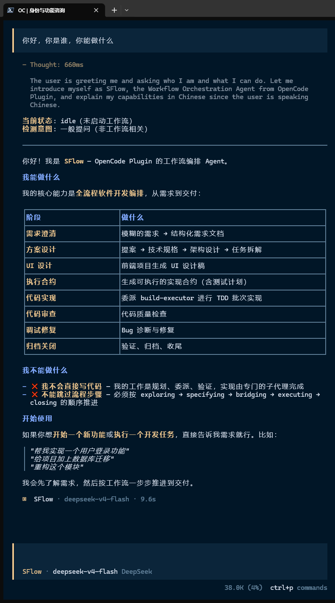

# sFlow — OpenCode Workflow Orchestration Plugin

OpenSpec 规划引擎 + Superpowers 执行纪律，集成于 OpenCode。

sFlow（S = Spec/planning, Flow = workflow execution）是一个完整的开发流程编排插件，从需求澄清到规划、实现、审查、调试、归档，全生命周期覆盖。

---

## 目录

- [概述](#概述)
- [工作流状态](#工作流状态)
- [智能体](#智能体)
- [工具](#工具)
- [执行模式](#执行模式)
- [执行纪律](#执行纪律)
- [oh-my-openagent 集成](#oh-my-openagent-集成)
- [功能特性](#功能特性)
- [安装](#安装)
- [配置](#配置)
- [使用方式](#使用方式)
- [预设升级机制](#预设升级机制)
- [智能体默认模型](#智能体默认模型)
- [模型优先级](#模型优先级)
- [项目结构](#项目结构)
- [致谢](#致谢)

---

## 概述

sFlow 是一个 OpenCode 插件，融合了两大核心能力：

- **OpenSpec** — 需求、规格说明书与提案的规划引擎
- **Superpowers** — TDD、代码审查与系统化调试的执行纪律

> **架构说明**：sFlow 的核心验证引擎（schema、validation、parsing）从 [spec-superflow](https://github.com/MageByte-Zero/spec-superflow) 移植。Agent 工厂模式、5 层钩子系统、工具注册、状态管理等运行时架构为适配 OpenCode 插件机制而全新设计，借鉴了 [oh-my-openagent](https://github.com/code-yeongyu/oh-my-openagent) 的架构模式。
>
> sFlow **零外部依赖**——子智能体路由使用自注册的 `call_flow_agent` 工具，无需安装 oh-my-openagent。当同时安装 oh-my-openagent 时，sFlow 可自动检测并利用其 `call_omo_agent`（探索/图书馆员）和 `task`（分类委托）工具，获得更强的代码库探索和技能注入能力。



---

## 工作流状态

sFlow 有 **9 个工作流状态**，按顺序执行：

| # | 状态 | 子智能体 | 产物 | 关卡 |
|---|------|---------|------|------|
| 1 | **exploring**（探索） | need-explorer | 澄清的需求 | 用户确认 |
| 2 | **specifying**（规格说明） | spec-writer | proposal.md, specs/, design.md, tasks.md | 产物校验 |
| 3 | **ui-design**（UI 设计）* | spec-writer | ui-design.md | UI Token 校验 |
| 4 | **bridging**（桥接） | contract-builder | execution-contract.md | 合约校验 |
| 5 | **approved-for-build**（批准构建） | — | 已批准的合约 | 用户批准 |
| 6 | **executing**（执行） | build-executor | 实现的代码 | 测试通过, 审查通过 |
| 7 | **debugging**（调试） | bug-investigator | Bug 报告, 修复 | 问题解决 |
| 8 | **closing**（关闭） | release-archivist | 验证报告 | 全部检查通过 |
| 9 | **abandoned**（废弃） | — | — | 终止状态 |

> *ui-design 状态仅对前端项目自动启用（通过 package.json 和目录结构检测）。

### 自动状态修复

每次上下文恢复时，sFlow 会重新检测当前产物状态，自动修复不一致：

| 状态文件说 | 但产物显示 | 自动修复 |
|-----------|----------|---------|
| `exploring` | proposal.md 存在 | → 跳转到 `specifying` |
| `specifying` | design.md + tasks.md 已生成 | → 跳转到 `bridging` |
| `bridging` | execution-contract.md 已批准 | → 跳转到 `approved-for-build` |
| `approved-for-build` | 所有任务已完成 | → 跳转到 `closing` |
| `executing` | 合约已过期 | → 回退到 `bridging` |

---

## 智能体

| 智能体 | 模式 | 说明 |
|--------|------|------|
| **sFlow** | 主编排器 | 工作流总控，检测状态 → 路由到子智能体，不直接写代码 |
| **need-explorer** | 子智能体 | 需求澄清：用户需求模糊时提问，文档化需求 |
| **spec-writer** | 子智能体 | 生成 proposal.md、规格、设计、任务、ui-design.md |
| **contract-builder** | 子智能体 | 创建执行合约，含边界控制、测试计划 |
| **build-executor** | 子智能体 | TDD/SDD 执行器，实现代码并按批次审查 |
| **bug-investigator** | 子智能体 | 系统化调试，诊断失败原因并修复 |
| **code-reviewer** | 子智能体 | 对照规格审查代码质量 |
| **release-archivist** | 子智能体 | 验证、归档、关闭变更 |
| **spec-merger** | 子智能体 | 增量规格变更合并 |
| **ui-implementer** | 子智能体 | 前端 UI 实现，融合 9 项前端专业技能 |

### UI Implementer 子智能体

前端 UI 实现专用子智能体，融合了 9 项前端专业技能，由 `skills/ui-implementer/SKILL.md` 统一注入：

| 技能来源 | 作用 | 说明 |
|---------|------|------|
| **taste-skill** | 设计品味控制 | 三旋钮设计系统、Design Read、AI 反模式禁令 |
| **impeccable** | 审查修复 | 生产级设计准则、Absolute Bans、交互规范 |
| **ui-ux-pro-max** | 视觉与交互 | 50+ 风格、调色板、字体配对 |
| **frontend-design** | 页面设计 | 组件布局与整页设计 |
| **shadcn-ui** | 组件库模式 | 组件选择、安装配置、主题定制 |
| **svg-architect** | SVG 图标设计 | 图标库选择、自定义 SVG 规范 |
| **polish** | 质量终检 | 间距系统、类名语义、响应式适配 |
| **frontend-code-review** | 代码质量 | 代码扫描、严重级别分级 |
| **frontend-performance-optimization** | 性能优化 | 加载/运行时性能、Core Web Vitals |

**调用方式**（双重入口）：
- **SFlow 直接委托** — 用于后工作流的小型前端修补
- **build-executor 委托** — 在 SDD 执行模式中，前端任务自动路由到 ui-implementer

**可选增强**（检测到 agnesmore provider 时自动启用）：
- `agnes_image_generate` 工具 — 生成产品图片、轮播图、卡片背景等
- `agnes_video_generate` 工具 — 生成页面背景视频、产品演示视频等

### 路由原则

- **NEVER** 自己实现代码 — 总是委托给子智能体
- **NEVER** 跳过状态 — 必须按顺序通过管线
- **NEVER** 自己批准自己的合约 — 用户必须批准
- **NEVER** 未经验证就关闭 — release-archivist 必须先验证

---

## 工具

### sFlow 原生工具

| 工具 | 说明 |
|------|------|
| `workflow_router` | 检测当前工作流状态，路由到对应子智能体 |
| `call_flow_agent` | **核心**：向 sFlow 子智能体委派任务（支持同步/异步） |
| `flowagent_output` | 获取异步子智能体的执行结果 |
| `flowagent_cancel` | 取消正在运行的异步子智能体任务 |
| `contract_validator` | 校验执行合约的正确性和完整性 |
| `artifact_inspector` | 审查规划产物的完整性和一致性 |
| `record_decision_point` | 记录决策点（DP-0 至 DP-5） |

### 产物校验工具集

| 工具 | 校验对象 |
|------|---------|
| `validate_spec` | 单份规格文件（SHALL/MUST 语句） |
| `validate_proposal` | 提案文件（Why + What Changes） |
| `validate_delta_spec` | 增量规格变更（ADDED/MODIFIED/REMOVED） |
| `validate_tasks` | 任务定义完整性 |
| `validate_contract` | 执行合约结构 |
| `validate_design` | 架构决策、约束、实现方案 |
| `validate_implementation` | 实现与规格/设计的一致性 |
| `detect_sync_conflicts` | 多增量规格之间的同步冲突 |

### oh-my-openagent 工具（可选集成）

当检测到 oh-my-openagent 已安装时，sFlow 自动启用以下工具：

| 工具 | 说明 | 使用场景 |
|------|------|---------|
| `call_omo_agent` | 调用 explore（代码探索）或 librarian（文献研究） | Exploring/Specifying 阶段并行探索 |
| `task` | 完整委托：类别模型选择 + 技能注入 | Build-executor 的 SDD 子任务分发 |

> **注**：未安装 oh-my-openagent 时，这些工具不可见，sFlow 完全通过 `call_flow_agent` 正常工作。

---

## 执行模式

`build-executor` 支持三种执行模式，自动选择或用户覆盖：

### 1. Inline 模式（直接执行）

**条件**：任务 ≤ 3 且无跨模块依赖
**行为**：当前 agent 直接实现代码（TDD 纪律仍然适用）
**适用**：小型变更、快速修复

### 2. Batch Inline 模式（批次直接执行）

**条件**：任务 > 3 但全部在同一个模块内，无 API/Schema 变更，预估 ≤ 15 分钟
**行为**：一次完成整个批次，每步仍执行 TDD 红-绿-重构循环
**适用**：同一模块内的多项小改动

### 3. SDD 模式（子智能体驱动开发）

**条件**：跨模块变更、高风险任务、或有架构影响的变更
**行为**：
1. 为每个任务派发独立的 implementer 子智能体
2. 每完成一批次进行 spec 合规 + 代码质量审查
3. 最终进行全局审查

当 **oh-my-openagent** 可用时，SDD 模式可进一步利用：

```bash
# 前端任务：visual-engineering 类别 + shadcn-ui 技能
task(category="visualEngineering", load_skills=["shadcn-ui"], run_in_background=true, prompt="...")

# 后端任务：deep 类别
task(category="deep", load_skills=["programming"], run_in_background=true, prompt="...")

# 简单修改：quick 类别
task(category="quick", prompt="Fix typo in README")
```

---

## 执行纪律

### TDD 铁律

```
NO PRODUCTION CODE WITHOUT A FAILING TEST FIRST
```

| 阶段 | 操作 | 证据 |
|------|------|------|
| **RED** | 编写会失败的测试 | 运行测试，确认因预期原因失败 |
| **GREEN** | 编写最小生产代码 | 测试通过（且所有其他测试仍通过） |
| **REFACTOR** | 在测试保持绿色时清理代码 | 完整测试套件仍然通过 |

### 文件边界控制

每个任务在执行合约中声明 `read_files`（参考边界）和 `write_files`（修改边界）。
提交前自动执行 `git diff --name-only` 验证，防止范围蔓延。

### 失败经验记录

```bash
# 每次调试退出时自动写入 .sflow/lessons.md
# 每个任务开始前自动扫描 lessons.md 防止重蹈覆辙
```

### 检查点恢复

```bash
.sflow/subagent-progress.md  # 节点状态（implementing/review/done）
.sflow/progress.md           # 批次完成进度
.sflow/lessons.md            # 跨任务经验教训库
```

---

## oh-my-openagent 集成

sFlow 可自动检测 oh-my-openagent 插件并利用其增强工具，**无需任何额外配置**。

### 检测机制

在插件初始化阶段，sFlow 通过 `cfg.plugin` 列表检测 oh-my-openagent：

```javascript
// 自动检测，无需用户干预
const hasOmo = cfg.plugin.some(p => 
  p === 'oh-my-openagent' || p === 'oh-my-opencode'
);
```

### 阶段增强映射

| sFlow 阶段 | 可用 omo 资源 | 增强效果 |
|-----------|--------------|---------|
| **exploring** | `call_omo_agent(explore)` 并行探索代码库 | need-explorer 获得代码库上下文 |
| **specifying** | `call_omo_agent(librarian)` 研究外部文档 | spec-writer 获得 API 最佳实践参考 |
| **bridging** | `task(category="deep")` 指定更优模型 | 复杂合约使用更强推理模型 |
| **executing** | `task` 的类别 + 技能注入系统 | build-executor 按任务类型选择模型和技能 |

### SDD 任务分类策略

使用 `task` 工具时，按任务类型选择推荐类别：

| 任务类型 | 推荐类别 | 注入技能 | 场景 |
|---------|---------|---------|------|
| 前端 UI | `visualEngineering` | shadcn-ui, frontend-design | 页面、组件、样式 |
| 后端逻辑 | `deep` | programming | API、服务、数据处理 |
| 简单修改 | `quick` | — | 单文件变更、小修复 |
| 文档 | `writing` | — | README、注释、文档 |
| 架构 | `ultrabrain` | — | 复杂设计决策 |

### 兼容性说明

- **无 oh-my-openagent**：sFlow 独立运行，所有功能正常
- **有 oh-my-openagent**：sFlow 自动启用增强工具，编排器策略说明会动态包含 omo 章节
- **两者都安装时**：工具名无冲突（sFlow 原生工具使用 `flowagent_*` 前缀）

---

## 功能特性

### 工作流管理

- 9 状态工作流，自动状态检测与路由
- 守卫条件防止非法状态转换
- 自动状态修复（artifact ↔ state 不一致时自动修复）
- 前后端项目自适应（前端自动插入 ui-design 状态）

### 预设升级机制

| 预设 | 降级条件 | 升级触发 |
|------|---------|---------|
| **hotfix** | ≤2 文件, 无架构变更 | 触及 3+ 文件、DB schema 改动等自动升级到 full |
| **tweak** | ≤4 配置文件, 无代码变更 | 触及 5+ 文件、跨模块等自动升级到 full |
| **full** | — | 标准流程 |

### 增量规格管理

- 跟踪每个变更的 ADDED/MODIFIED/REMOVED/RENAMED 规格
- 自动检测跨变更的规格同步冲突
- spec-merger 在关闭时合并增量规格回主线

### 钩子系统

| 钩子 | 触发时机 | 说明 |
|------|---------|------|
| `state_transition` | 状态转换时 | 记录转换日志 |
| `artifact_validation` | 工具执行后 | 校验产物完整性 |
| `guard` | 工具执行前 | 阻止非法操作（如未经批准就执行） |
| `pre_process` | 消息处理前 | 注入上下文 |
| `post_process` | 工具执行后 | 检测状态转换信号 |
| `continuation` | 上下文压缩后 | 决定是否自动继续 |

---

## 安装

### 通过 npm

```bash
npm install -g opencode-sflow
```

### 从源码编译

```bash
git clone https://gitee.com/opencode-plugin/opencode-sflow.git
cd opencode-sflow
npm install
npm run build
```

---

## 配置

### OpenCode 配置

在 `opencode.json` 中添加插件：

```json
{
  "plugin": ["opencode-sflow"]
}
```

如需同时安装 oh-my-openagent：

```json
{
  "plugin": ["oh-my-openagent", "opencode-sflow"]
}
```

### 创建 .sflow/config.json

```bash
# 项目级配置（推荐）
sflow init

# 用户级全局配置（所有项目共享）
sflow init --user
```

配置加载优先级（从高到低）：

1. **项目级 `.sflow/config.json`** — 覆盖用户级配置
2. **用户级 `~/.sFlow/config.json`** — 全局默认

### 自定义智能体模型

```json
{
  "agents": {
    "sflow": {
      "model": "deepseek-v4-flash",
      "temperature": 0.6,
      "fallback_models": ["glm-5.1", "kimi-k2.6"]
    },
    "build-executor": {
      "model": "step-3.7-flash",
      "temperature": 0.7
    }
  }
}
```

---

## 使用方式

### 开启工作流

```
"开始一个新功能"  或  "start a workflow"
```

sFlow 会：
1. 检测当前工作流状态
2. 路由到对应子智能体
3. 引导你逐步完成

### 常用指令

| 你说 | 动作 |
|------|------|
| "开始一个新功能" | 启动工作流 |
| "继续" | 继续当前工作流 |
| "帮我看看" | 检查当前状态 |
| "解释这个" | 解释当前状态或产物 |

### 斜杠命令

```
/workflow-start     # 进入工作流主入口
/need-explorer      # 需求澄清
/spec-writer        # 规格生成
/contract-builder   # 合约构建
/build-executor     # 实现
/bug-investigator   # 调试
/code-reviewer      # 代码审查
/release-archivist  # 归档
/spec-merger        # 规格合并
```

---

## 预设升级机制

在工作流运行过程中，sFlow 持续监控范围。如果触及升级条件，自动提醒用户。

### hotfix → full 升级条件

任务中任何一项触发即升级：

- 修改 3+ 个文件
- 引入新模块/新接口/新依赖
- 更改数据库 schema
- 创建新公开 API
- 范围超出单个函数/模块
- 需要跨模块协调

### tweak → full 升级条件

- 修改 5+ 个文件
- 需要跨模块协调
- 需要 5+ 个新测试用例
- 新增或删除配置项（不仅修改值）
- 需要新能力不在原范围中
- 影响已有规格（需要 delta spec）

---

## 智能体默认模型

| 智能体 | 默认模型 | 备用模型 |
|--------|----------|----------|
| sFlow | deepseek-v4-flash | glm-5.1, kimi-k2.6 |
| need-explorer | kimi-k2.6 | glm-5.1, deepseek-v4-flash |
| spec-writer | glm-5.1 | kimi-k2.6, deepseek-v4-flash |
| contract-builder | glm-5 | glm-5.1, deepseek-v4-flash |
| build-executor | step-3.7-flash | deepseek-v4-flash, glm-5.1 |
| bug-investigator | minimax-m2.7 | deepseek-v4-flash, glm-5.1 |
| code-reviewer | deepseek-v4-flash | glm-5.1, kimi-k2.6 |
| release-archivist | mimo-v2.5-pro | mimo-v2.5, glm-5.1 |
| spec-merger | mimo-v2.5 | mimo-v2.5-pro, glm-5.1 |

---

## 模型优先级

模型选择遵循以下优先级（从高到低）：

1. **AgentOverrides**（编程传入的覆写参数）
2. **createAgent 的 model 参数**
3. **`.sflow/config.json` 配置文件**
4. **代码内建的 DEFAULT_MODELS**

模型不可用时，按备用模型列表依次尝试。

---

## 项目结构

```
opencode-sflow/
├── packages/
│   ├── core/                    # 模式、校验、解析引擎
│   ├── opencode-adapter/        # 智能体、钩子、工具、功能
│   │   └── src/
│   │       ├── agents/          # 9 个子智能体 + agent 构建器
│   │       ├── hooks/           # 6 类插件的生命周期钩子
│   │       ├── tools/           # 工具定义和实现
│   │       ├── features/        # 工作流管理器、状态管理器、MCP
│   │       └── helpers/         # 轮询等辅助函数
│   └── shared/                  # 共享工具函数
├── skills/                      # 工作流技能定义（SKILL.md）
│   ├── workflow-start/          # 工作流入口技能
│   ├── build-executor/          # 执行器技能
│   └── ...
├── templates/                   # 产物模板
├── docs/                        # 技术文档
├── config.example.json          # 配置示例
└── .sflow/
    └── config.json              # 项目配置（由 sflow init 生成）
```

---

## 致谢

- [OpenSpec](https://github.com/Fission-AI/OpenSpec) — 规划引擎
- [Superpowers](https://github.com/obra/superpowers) — 执行纪律
- [oh-my-openagent](https://github.com/code-yeongyu/oh-my-openagent) — 架构灵感 + 可选集成
- [spec-superflow](https://github.com/MageByte-Zero/spec-superflow) — 验证引擎移植来源