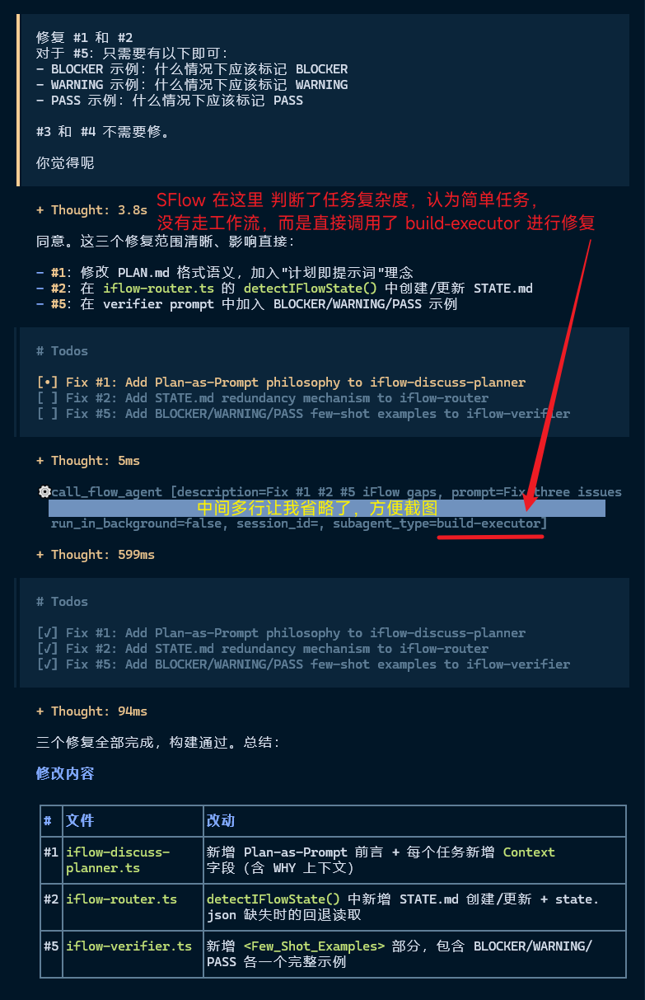

opencode-flow-engine 开源地址：https://github.com/nreg/opencode-flow-engine

gitee：https://gitee.com/opencode-plugin/opencode-flow-engine

使用方式：

```
git clone https://gitee.com/opencode-plugin/opencode-flow-engine
cd opencode-flow-engine 
npm run build
```

在 opencode 的全局配置目录下配置文件：~/.config/opencode/opencode-flow-engine.json

```
{
  "version": "0.1.0",
  "mode": "full",
  "agents": {
    "sFlow": {
      "model": "sensemore/deepseek-v4-flash",
      "temperature": 0.6,
      "fallbackModels": [
        "freebuff/deepseek-v4-flash",
        "modelscopemore/deepseek-v4-flash"
      ]
    },
    "iFlow": {
      "model": "sensemore/deepseek-v4-flash",
      "temperature": 0.6,
      "fallbackModels": [
        "freebuff/deepseek-v4-flash",
        "modelscopemore/deepseek-v4-flash"
      ]
    },
    "need-explorer": {
      "model": "stepfunmore/step-3.7-flash",
      "temperature": 0.6,
      "fallbackModels": [
        "nvidiamore/step-3.7-flash",
        "nvidiamore/step-3.5-flash",
        "stepfunmore/step-3.5-flash",
        "stepfunmore/step-3.5-flash-2603",
        "modelscopemore/step-3.5-flash"
      ]
    },
    "spec-writer": {
      "model": "codearts/glm-5.1",
      "temperature": 0.6,
      "fallbackModels": [
         "sensemore/glm-5.2",
         "devecocode/glm-5"
      ]
    },
    "contract-builder": {
      "model": "devecocode/glm-5.1-w4a8",
      "temperature": 0.6,
      "fallbackModels": [
        "sensemore/glm-5.2",
        "devecocode/glm-5",
        "modelscopemore/glm-5",
        "devecocode/glm-5.1-w4a8"
      ]
    },
    "build-executor": {
      "model": "codearts/glm-5.1",
      "temperature": 0.7,
      "fallbackModels": [
        "sensemore/glm-5.2",
        "devecocode/glm-5"
      ]
    },
    "bug-investigator": {
      "model": "nvidiamore/minimax-m2.7",
      "temperature": 0.6,
      "fallbackModels": [
        "nvidiamore/kimi-k2.6"
      ]
    },
    "code-reviewer": {
      "model": "codearts/glm-5.1",
      "temperature": 0.6,
      "fallbackModels": [
        "sensemore/glm-5.2",
        "devecocode/glm-5"
      ]
    },
    "release-archivist": {
      "model": "codearts/glm-5.1",
      "temperature": 0.7,
      "fallbackModels": [
        "sensemore/glm-5.2",
        "devecocode/glm-5"
      ]
    },
    "spec-merger": {
      "model": "codearts/glm-5.1",
      "temperature": 0.7,
      "fallbackModels": [
        "sensemore/glm-5.2",
        "devecocode/glm-5"
      ]
    },
    "ui-implementer": {
      "model": "codearts/glm-5.1",
      "temperature": 0.6,
      "fallbackModels": [
        "nvidiamore/kimi-k2.6"
      ]
    },
    "iflow-discuss-planner": {
      "model": "nvidiamore/kimi-k2.6",
      "temperature": 0.6,
      "fallbackModels": [
        "stepfunmore/step-3.7-flash",
        "nvidiamore/step-3.5-flash"
      ]
    },
    "iflow-plan-executor": {
      "model": "codearts/glm-5.1",
      "temperature": 0.6,
      "fallbackModels": [
        "sensemore/glm-5.2",
        "devecocode/glm-5"
      ]
    },
    "iflow-verifier": {
      "model": "nvidiamore/minimax-m2.7",
      "temperature": 0.6,
      "fallbackModels": [
        "nvidiamore/kimi-k2.6"
      ]
    },
    "iflow-researcher": {
      "model": "codearts/glm-5.1",
      "temperature": 0.7,
      "fallbackModels": [
        "nvidiamore/kimi-k2.6",
        "sensemore/glm-5.2"
      ]
    },
    "iflow-shipper": {
      "model": "codearts/glm-5.1",
      "temperature": 0.6,
      "fallbackModels": [
        "sensemore/glm-5.2",
        "devecocode/glm-5"
      ]
    }
  },
  "features": {
    "workflow_manager": true,
    "state_manager": true
  },
  "hooks": {
    "state_transition": true,
    "artifact_validation": true,
    "guard": true
  },
  "tools": {
    "workflow_router": true,
    "contract_validator": true,
    "artifact_inspector": true
  }
}
```

在 OpenCode 的全局配置文件中注册插件：~/.config/opencode/opencode.json

```
  ...
  "plugin": [
    "E:/work/nreg/ai-agent/opencode-flow-engine",
    "oh-my-openagent@latest"
  ],
  ...
```

**说明：**

**SFlow** ： OpenSpec 规划引擎 + Superpowers 执行纪律 线性工作流：从需求澄清到规划、实现、审查、调试、归档，全生命周期覆盖
**IFlow** ： GSD（Get Stuff Done）迭代循环 工作流：讨论 → 研究 → 规划 → 执行 → 验证 → 发布 → 循环

SFow 与 IFlow 的关系：

> SFlow 是基于 OpenSpec 风格的线性工作流（proposal → specs → design → contract → build → close），适用于需要严格规划、文档先行、门禁驱动的开发场景。然而，许多开发任务更适合 GSD（Get Stuff Done）风格的迭代循环：先讨论理解需求，再规划研究方案，然后执行实现，验证交付，最后发布归档。IFlow 提供这种循环式工作流，与 SFlow 互补而非替代。IFlow 的关键差异在于：(1) 循环执行——shipping 后回到 discussing 开始下一阶段，而非线性终止；(2) GSD 风格产出物——CONTEXT.md、PLAN.md、SUMMARY.md、UAT.md，更轻量更实用；(3) 始终完整循环——不支持快速模式，确保每个需求都经过完整验证；(4) 可与 SFlow 互相调用——通过 call_flow_agent 跨工作流协作。共享 packages/core 和 packages/opencode-adapter 基础设施，避免重复建设。

**借鉴说明：**
底层架构：借鉴了[oh-my-openagent](https://github.com/code-yeongyu/oh-my-openagent) 的多智能体协作机制：

> Agent 工厂模式、5 层钩子系统、工具注册、状态管理等运行时架构

实现逻辑上:

> SFlow 主要是 [spec-superflow](https://github.com/MageByte-Zero/spec-superflow) 的移植，但也借鉴了 [comet](https://github.com/rpamis/comet) 和 [flow-kit](https://github.com/rihebty/flow-kit) 一些优秀的实现
> IFlow 主要是 [gsd-opencode](https://github.com/rokicool/gsd-opencode) 的移植，虽然 gsd-opencode 也是用于OpenCode，但是它的架构比较简单，仅仅只是把 agent 和 command 的文件移到了 OpenCode 的全局配置目录下，没有 PluginModule，没有 TypeScript 编译，没有 hooks，没有状态机。

**关于借鉴的一些文章：**
spec-superflow:

https://mp.weixin.qq.com/s/pgzZccGTxCVhaHLhOxXOvg

spec + superflow + comet:

https://mp.weixin.qq.com/s/1g7FRte8w_vV-kXcBxtVDw

flow-kit:

https://mp.weixin.qq.com/s/6NSD1WoKRXTHR0exWBKXtg

https://mp.weixin.qq.com/s/gvRWbnB1heYGhUtNGYetWQ

**IFlow 与 SFlow 一定会走 工作流 吗？**

> 不，IFlow 与 SFlow 都有任务复杂度评估机制，如果任务量小且简单，会直接调用 对应的 构建智能体，不会走工作流



**当前状态：**
SFLow 经过 多个实战项目测试，已经相对完善了，可以用于工作，IFlow 是由 SFlow 做的，迭代到目前 尚未使用实战项目测试。

**实现这个项目的动机：**

> 1、omo 的 Sisyphus 直接 实现代码 总会有遗漏 和 bug，一次性实现基本只能实现需求的 20%。
> Prometheus 与 Atlas 的组合 由于 其子智能体各自为政，同一代码文件 不同子智能体实现不同功能，导致没有整体性，因而会有大量的bug。
> 总之，omo 的实战体验 总是要 review 多次。使用 omo 来实现 SFlow  进行了 几十轮的 review。
> 2、现在的agent未解决的弊端就是不会生成图片与短视频来生成项目的测试数据，或者装饰页面。

当前可用版本（gitee和github还在优化）：
[opencode-flow-engine.zip](https://pan.baidu.com/s/1Vats9O6TbunmecUdtJqgXw?pwd=flow)